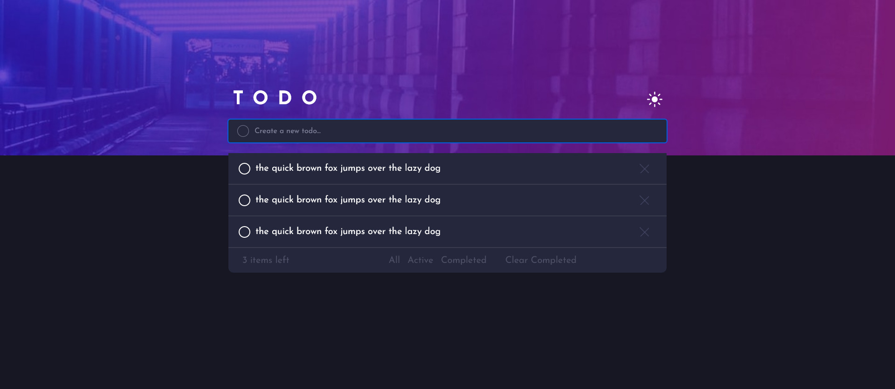
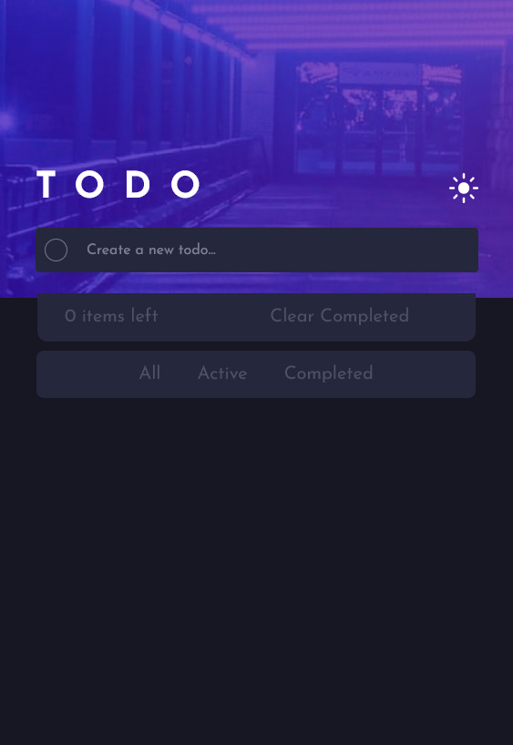

# Frontend Mentor - Todo App Solution

## Table of contents

  - [The challenge](#the-challenge)
  - [Screenshot](#screenshot)
  - [Built with](#built-with)

### The challenge

Users should be able to:

- View the optimal layout for the site depending on their device's screen size
- See hover states for all interactive elements on the page

### Screenshot

-Desktop

-Mobile

### Built with

- Semantic HTML5 markup
- CSS custom properties
- Sass Css Preprocessor
- Flexbox
- CSS Grid
- Mobile-first workflow
- JavaScript
- GSAP(https://greensock.com/) - JS library
- SortableJS(https://sortablejs.github.io/Sortable/) - JS library

